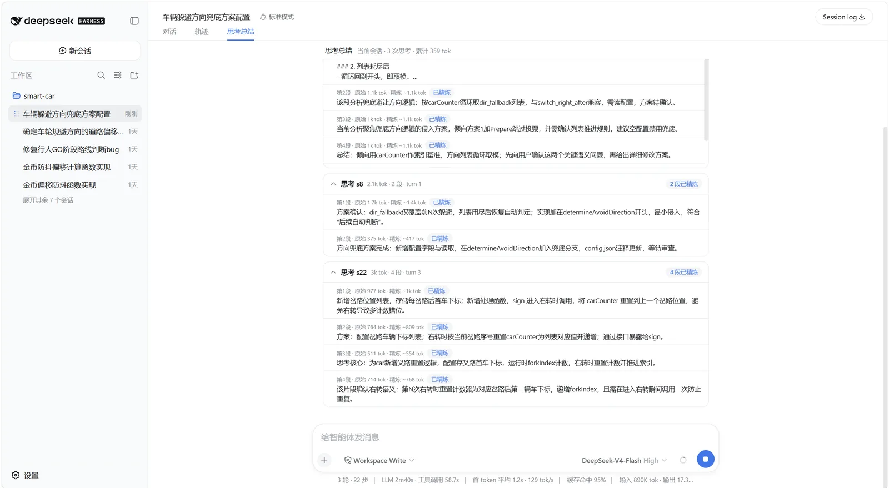

# dsh-think-summary

> DSH（Cordis 架构）双面插件：**长思考链分段总结** —— 检测模型的长思考，边思考边分段，
> 逐段产出摘要，实时展示在聊天区，附带设置页与历史持久化。

- 版本：`0.1.2`（npm 标签 `v0.1.1` / `v0.1.2`）
- 许可：[MIT](./LICENSE)
- Host 半面（检测 / 分段 / 总结 / 精炼 / 持久化）：`src/host/*`，TypeScript → `lib/`
- 客户端半面（面板 / 总结条 / 视图 / 设置卡）：`src/client/*`，纯 JS → `lib/client.js`

---

## 特性

- **长思考检测**：`llm/stream` 瀑布实时观察 `reasoning-delta`，轻量 token 计数
  （CJK 自适应、原始计数不取整），超过阈值自动进入分段模式；默认过滤无
  sessionId 的旁路流（子代理 / 标题生成）。
- **语义分段**：双阈值（最小窗口 1500 / 硬上限 3000 token）+ **Markdown 结构感知**
  （围栏状态机——代码块整体原子、围栏内不误切；表格整体保留；列表只在项边界切；
  标题/有序列表/任务项/引用/分隔线/行首结构词边界；max 强制切回溯到最近句末/行末；
  `blockType` 切换强信号），只缓存未总结余量，内存有界、state 级哈希去重。
- **代码块/表格三态处理**：`ignore`（默认，内容不写内存、不计段 token、不精炼，
  总结卡片**不显示**任何代码块/表格痕迹）/ `keep-skip`（保留+结构化摘要、
  跳过精炼）/ `keep-refine`（保留并精炼）；总思考 token（阈值/进度）始终计入代码量。
- **逐段总结**：启发式提取（0 token）即时出；**精炼**用会话 provider 的最小可用
  模型精炼可精炼段（输入预算 + 裁剪三档：头尾 / 仅尾部 / 完整保留；展示截断
  ~60 token；并发池默认 3、任务互不打断、超时释放并发位；异常自动回退启发式并
  在段上标注原因）；段头同时显示**原始输出 token**（含被忽略的代码/表格）与
  **精炼实际 token**（输入裁剪后 + 输出摘要）。
- **实时面板**：composer 上方实时面板（思考进度 + 滚动分段摘要，仅"对话"视图
  显示），客户端每 1.5s 轮询 `/api/think-summary/state`；总结**不写回会话上下文**，
  零污染。
- **聊天流内总结条**：每条回复末尾（turnTail 槽位）显示该 turn 的思考总结，
  按每次思考（step）分组、默认折叠。
- **思考总结视图**：会话头部"思考总结"选项卡，列出当前会话**全部**被记录的
  思考（每段摘要 + 原始/精炼双 token + 状态标签），可折叠、自动滚底、
  折叠状态 localStorage 持久化。
- **事后兜底**：`session/event` 事件流断流/异常时补跑分段总结，不丢摘要，
  兜底分段同样入队精炼（用会话默认模型）。
- **主模型自产小结**（可选，默认关）：`selfSummary` 设为 `prompt` 后，向系统提示词
  注入小结指令，流内捕获【思考小结】标记直接展示（仅展示补充，不影响外部分段）。
- **持久化**：思考总结保存到 `~/.dsh/dsh-think-summary.json`（原子写：tmp+rename、
  每次状态变更同步落盘），重启 dsh 后仍可查看历史总结；支持已归档会话的
  自动/手动清理（默认宽限保留最近 24h，防误清）。
- **设置页**：官方插件配置区卡片（自建 loopback 设置桥，分组可折叠），改动即时生效。

## 界面预览

思考进行中，输入框上方的实时面板逐段滚动展示摘要（左侧），会话头部的
"思考总结"选项卡汇总当前会话全部历史总结（右侧）：




## 架构速览

```
模型流 ─► llm/stream 包裹（检测+分段+启发式总结+精炼入队）──► state（会话级）
                                                                  │
session/event 兜底补跑 ◄──────────────────────────────┐          │
                                                      ▼          ▼
                    持久化：~/.dsh/dsh-think-summary.json ◄── 原子写（每次变更）
                                                      │
   客户端：settings.plugin.item 设置卡 ◄─ loopback 设置桥 ─ /api/think-summary/*
   客户端：conversation.input.dock 实时面板 ◄── 轮询 ── /api/think-summary/state
   客户端：conversation.chat.turnTail 回复末尾总结条 ◄── 有限重试 ── /api/think-summary/state
   客户端：conversation.view "思考总结"选项卡 ◄── 轮询 ── /api/think-summary/state
```

## 安装（多路通用）

同时兼容 **DSH web profile 插件机制**（Host + 浏览器双面）与 **纯 Cordis 装载**（仅 Host 面）。

### 方式一：本地开发（符号链接 + 自动补丁）⭐

```bash
dsh plugin --profile web add link:/绝对/路径/to/dsh-think-summary
# Windows 示例：dsh plugin --profile web add link:D:/Files/zzj/Programs/webs/dsh-plugins/dsh-think-summary
# 卸载
dsh plugin --profile web remove dsh-think-summary
```

该命令在 `~/.dsh/profiles/web/` 下完成三件事：向 `package.json` 写入
`link:` 依赖、在 `node_modules` 建立符号链接、把包加入 `dsh.profile.bundles`
（由包内 `dsh.bundle.patch` 声明的 `cordis.patch.yml` 补丁层生效，插入
`think-summary` 插件行）。浏览器客户端经 `dsh.client` 声明装载于
`/plugins/dsh-think-summary/client.js`。**需要本机可用的 pnpm**。

### 方式二：npm 包（发布后）

```bash
npm publish            # 或私有 registry
dsh plugin --profile web add dsh-think-summary
```

### 方式三：手动 cordis.yml 行（仅 Host 面，无浏览器 UI）

```yaml
- path: /绝对/路径/to/dsh-think-summary   # 本地路径
# 或
- pkg: dsh-think-summary                  # npm 包名
```

此方式只装载 Host 面（检测 / 分段 / 总结 / 精炼 / 持久化均可用），无设置页与实时面板。

### 方式四：手动 web profile 补丁（不依赖 CLI / pnpm）

1. 建立符号链接（Windows 用 junction）：

```powershell
New-Item -ItemType Junction -Path "$HOME\.dsh\profiles\web\node_modules\dsh-think-summary" `
  -Target "D:\Files\zzj\Programs\webs\dsh-plugins\dsh-think-summary"
```

2. 二选一接线：

```yaml
# a) 编辑 ~/.dsh/profiles/web/package.json，把包加入 dsh.profile.bundles：
#    "bundles": ["@deepseek-ai/dsh-base", ..., "dsh-think-summary"]
# b) 或编辑 ~/.dsh/profiles/web/cordis.patch.yml 追加：
- insert:
    - id: think-summary
      name: 'dsh-think-summary'
```

3. 重启 dsh web 生效。

## 设置

侧边栏 设置 → 插件配置 → think-summary 卡片（默认折叠，分组展开）：

| 分组 | 字段 | 默认 | 说明 |
|---|---|---|---|
| （顶部） | 启用插件 | `true` | 总开关：关闭后不检测/不分段/不精炼/不注入提示词，客户端总结 UI 全部隐藏 |
| 检测与分段 | 长思考阈值 | `2000` | thinking tokens 超过即判定长思考并开始分段 |
| 检测与分段 | 段最小窗口 | `1500` | 达到后可切（等待语义边界信号） |
| 检测与分段 | 段硬上限 | `3000` | 到点强制切（回溯到最近句末/行末），保证缓冲有界 |
| 小模型精炼 | 精炼 | `true` | 开启后所有**可精炼**分段都用会话 provider 最小模型精炼摘要 |
| 小模型精炼 | 代码块处理 | `ignore` | 忽略（内容不写内存、不精炼、卡片不显示）/ 保留+跳过精炼 / 保留并精炼 |
| 小模型精炼 | 表格处理 | `ignore` | 同上 |
| 小模型精炼 | 精炼输入裁剪 | `headtail` | 头尾（保主题+结论、丢中段）/ 仅尾部 / 完整保留（不裁剪） |
| 小模型精炼 | 精炼预算 | `1024` | 精炼 API 完成预算（推理 + 答案），token |
| 小模型精炼 | 精炼并发 | `3` | 并行精炼数；任务之间互不打断 |
| 小模型精炼 | 精炼超时 | `60` | 单任务超时（秒）；卡死任务超时放弃并释放并发位 |
| 小模型精炼 | 精炼模型 | `auto` | `'auto'` = 会话 provider 最小可用模型；可显式指定 |
| 小模型精炼 | 精炼提示词 | （默认模板） | 精炼时发给模型的 system 提示词，可修改（留空恢复默认） |
| 主模型自产小结 | 模式 | `off` | 关闭 / `prompt`（注入提示词并流内捕获【思考小结】直接展示） |
| 存储与清理 | 持久化保存 | `true` | 保存思考总结到 `~/.dsh/dsh-think-summary.json`，重启后仍可查看 |
| 存储与清理 | 自动清理 | `false` | 定期清理已归档（非活跃）会话的思考总结 |
| 存储与清理 | 归档保留天数 | `30` | 会话归档（非活跃）超过该天数后自动清理其总结 |
| 存储与清理 | 立即清理（按钮） | — | 立即删除所有非活跃会话的思考总结（默认宽限保留最近 24h） |

> 另有 schema 级默认项（设置卡未暴露，可用配置/持久化直写）：
> `filterNonAgentLoop`（默认 `true`，只处理带 sessionId 的请求）、
> `refineMaxInputTokens`（默认 `1500`，精炼输入预算）。

改动即时生效（阈值/开关在每次流开始时读取），无需重启。

## 使用与验证

1. 触发长思考：向模型提出需要深度推理的问题（超过 `长思考阈值`）。
2. 思考进行中，composer 上方出现实时面板：`● 思考中 · N tok · M 段`，
   分段摘要滚动追加；开启精炼的段稍后标记"已精炼"。
3. 思考结束面板转为"思考结束"；下一次思考积累期会保留上次总结作为参照。
4. 每条回复末尾出现可折叠的"思考总结"条（该 turn 所有有段思考，按 step 分组）；
   会话头部的"思考总结"选项卡可查看当前会话全部历史总结。
5. 阈值内的短思考不产出分段（不打扰）；代码块/表格在 `ignore` 模式下不显示任何痕迹。

## HTTP 接口（Host 提供，浏览器同源直连）

| 方法 | 路径 | 说明 |
|---|---|---|
| GET | `/api/think-summary/state?sessionId=` | 会话思考状态视图（`enabled` + `state`；sessionId 缺省用最近活跃会话） |
| POST | `/api/think-summary/settings/describe` | 设置命名空间视图（value/base/user/revision/writable） |
| POST | `/api/think-summary/settings/mutate` | 逐字段 set/unset（revision 围栏） |
| POST | `/api/think-summary/clear-archived` | 清理已归档会话总结（`{ graceMs? }`，缺省保留最近 24h） |

settings 与 clear-archived 接口为 loopback-only（拒绝非本机来源）。

## 开发

```bash
npm install
npm run build      # tsc 编译 Host + 打包客户端 bundle（lib/client.js）
npm run typecheck
node scripts/seg-check.mjs     # 分段算法回归（围栏原子/表格整体/句末回溯/元数据）
node scripts/order-check.mjs   # 客户端 bundle 模块顺序检查
```

内部设计文档（design / probe-notes / segment-optimization / self-summary-mode）
保留在仓库根 `docs/` 目录，仅贡献者可见，**不随 npm 包发布**。

### 调试循环（改码 → 生效）

```bash
npm run watch:all     # 并行：tsc --watch（Host → lib/）+ 客户端 bundle watch
```

| 改动位置 | 生效方式 |
|---|---|
| `src/client/*.js`（面板/总结条/视图/设置页/样式） | bundle 自动重建后**刷新浏览器**即生效，无需重启 dsh |
| `src/host/*.ts`（检测/分段/总结/精炼/持久化） | `lib/` 编译后**重启 dsh web** 生效 |

只盯客户端时单独跑 `npm run watch:client`（仅监听 `src/client/`，更省资源）。

> 客户端 bundle 由宿主实时读取（改后刷新浏览器即生效）；Host 半面改动需重启 dsh。

### 部署要点（实测确认）

官方设置桥（dsh-host-apiproxy）只把白名单命名空间服务给浏览器，web-ui 组的桥接
（`/api/dsh-web-ui-settings`）也只认家族插件清单 —— **独立第三方插件的设置卡片
必须自建 loopback 设置桥**。本插件已实现：`POST /api/think-summary/settings/describe|mutate`
（宿主直连 settings 服务、revision 围栏），客户端用迷你 scope 控制器读写，不依赖
web-ui 组。

## 许可

[MIT](./LICENSE)
